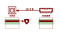

#### Rogue Memory: A Hidden Security Threat

  <!-- Icon -->
  

    
  

  <!-- Text Content -->
  

      Computers rely on a processor to perform calculations and <a href="https://en.wikipedia.org/wiki/Computer_memory">memory</a> (<abbr title="Dynamic Random Access Memory">DRAM</abbr>) to store code and data.
      Adding more memory can boost performance, with different tasks demanding varying amounts.
      When a computer starts up, it communicates with the connected DRAM modules to learn their size, speed, and configuration.
      <em class="">But what if the DRAM module can be tricked into lying to the processor?</em>
  

For the first time, we have studied the security risks of "bad RAM" — rogue memory modules that deliberately provide false information to the processor during startup. 
Our findings reveal a surprising and previously underexplored weakness in modern processor security technologies.

#### A $10 Hack That Erodes Trust in the Cloud

  <!-- Icon -->
  

    
  

  <!-- Text Content -->
  

    Modern computers increasingly use encryption to protect sensitive data in DRAM, especially in shared cloud environments with pervasive data breaches and insider threats.
    <a href="https://www.amd.com/en/developer/sev.html" class="fw-medium">AMD's Secure Encrypted Virtualization (SEV)</a> is a cutting-edge technology that protects privacy and trust in cloud computing by encrypting a virtual machine's (VM's) memory and isolating it from advanced attackers, even those compromising critical infrastructure like the virtual machine manager or firmware.
  

We found that tampering with the embedded [<abbr title="Serial Presence Detect">SPD</abbr> chip](https://en.wikipedia.org/wiki/Serial_presence_detect) on commercial DRAM modules allows attackers to bypass SEV protections --- including AMD’s latest <abbr title="Secure Encrypted Virtualization - Secure Nested Paging">SEV-SNP</abbr> version. For less than $10 in off-the-shelf <a class="accordion-trigger" data-target="#collapsebom">equipment</a>, we can trick the processor into allowing access to encrypted memory. We build on this BadRAM attack primitive to completely compromise the AMD SEV ecosystem, faking remote attestation reports and inserting backdoors into _any_ SEV-protected VM.

To mitigate the BadRAM vulnerability, AMD has issued <a href="https://www.amd.com/en/resources/product-security/bulletin/amd-sb-3015.html">firmware updates</a> to securely validate memory configurations during the processor’s boot process.

#### BadRAM in 3 Simple Steps

  

    <!--<h4>BadRAM in 3 Simple Steps</h4>-->
     <ol>
      <li><b>Compromise the memory module</b>
      
BadRAM makes the memory module intentionally lie about its size, tricking the CPU into accessing nonexistent "ghost" addresses that are silently mapped to existing memory regions.
      

      </li>
      <li><b>Find aliases</b>
      
Two CPU addresses now map to the same DRAM location. Our <a class="accordion-trigger" data-target="#collapsegithub">practical tools</a> find these aliases in minutes.
</li>
      <li><b>Bypass CPU Access Control</b>
      
Through these aliases, attackers can bypass CPU memory protections, exposing sensitive data or causing disruptions.
</li>
    </ol> 
  

  

    

        
        
        
        
    

  

### BadRAM in Action

  

    

        

          <h4>Attack 1/2: Simple Replay</h4>
          

            In this attack demo we show how an attacker uses the BadRAM primitive to capture the content of a memory location of an SEV-SNP VM and replay it later on.
            This forms the building block for more advanced attacks.
          

           
          

          <iframe src="https://www.youtube.com/embed/AUKR0Q5xWW8?si=dwcCK11BeH2l_PJk" title="YouTube video player" frameborder="0" allow="accelerometer; autoplay; clipboard-write; encrypted-media; gyroscope; picture-in-picture; web-share" referrerpolicy="strict-origin-when-cross-origin" allow=fullscreen></iframe>
          

      

    

    

          

        <h4>Attack 2/2: Breaking SEV-SNP Attestation</h4>
        

        The attestation report is a cryptographic measurement of a confidential <abbr title="Virtual Machine">VM</abbr> that proves to the remote owner that their VM is protected correctly and has not been tampered with.
        Using the BadRAM attack, we can capture and replay the expected attestation measurement of a correct VM, making any malicious changes, such as inserting a completely invisible and undetectable backdoor into the remote VM owner.
        This effectively breaks all trust in the SEV-SNP ecosystem.
        

         
        

        <iframe src="https://www.youtube.com/embed/zhDACoigQ9M?si=zyTJiPe9VcqLmKey" title="YouTube video player" frameborder="0" allow="accelerometer; autoplay; clipboard-write; encrypted-media; gyroscope; picture-in-picture; web-share" referrerpolicy="strict-origin-when-cross-origin" allow=fullscreen></iframe>
        

    

    

  

  <button class="carousel-control-prev" type="button" data-bs-target="#carouselExample" data-bs-slide="prev">
    
    <!--span> Previous</span-->
  </button>
  <button class="carousel-control-next" type="button" data-bs-target="#carouselExample" data-bs-slide="next">
    
    <!--span class="visually-hidden">Next</span-->
  </button>

### Questions and Answers

  

    <h2 class="accordion-header">
      <button class="accordion-button" type="button" data-bs-toggle="collapse" data-bs-target="#collapseFiveteen" aria-expanded="true" aria-controls="collapseFiveteen">
        Who conducted this research? 
      </button>
    </h2>
    

      

        The research was conducted by researchers from 
        <a class="link-dark" href="https://www.kuleuven.be/english/kuleuven/index.html">KU Leuven</a>, 
        the <a class="link-dark" href="https://www.its.uni-luebeck.de/en/institute">University of Lübeck</a>, 
        and the <a class="link-dark" href="https://www.birmingham.ac.uk/">University of Birmingham</a>.
        <ul>
            <li>
                <a href="https://www.esat.kuleuven.be/cosic/people/person/?u=u0156850">Jesse De Meulemeester</a> 
                (<a class="link-secondary" href="https://www.esat.kuleuven.be/cosic/">COSIC</a>, 
                <a class="link-secondary" href="https://www.esat.kuleuven.be/english">Department of Electrical Engineering</a>, 
                <a class="link-secondary" href="https://www.kuleuven.be/english/kuleuven/index.html">KU Leuven</a>)
            </li>
            <li>
                <a href="https://luca-wilke.com/">Luca Wilke</a> 
                (<a class="link-secondary" href="https://www.its.uni-luebeck.de/en/institute">University of Lübeck</a>)
            </li>
            <li>
                <a href="https://www.birmingham.ac.uk/staff/profiles/computer-science/academic-staff/oswald-david">David Oswald</a> 
                (<a class="link-secondary" href="https://www.birmingham.ac.uk/">University of Birmingham</a>)
            </li>
            <li>
                <a href="https://www.its.uni-luebeck.de/en/staff/thomas-eisenbarth">Thomas Eisenbarth</a> 
                (<a class="link-secondary" href="https://www.its.uni-luebeck.de/en/institute">University of Lübeck</a>)
            </li>
            <li>
                <a href="https://www.esat.kuleuven.be/cosic/people/person/?u=u0018159">Ingrid Verbauwhede</a> 
                (<a class="link-secondary" href="https://www.esat.kuleuven.be/cosic/">COSIC</a>, 
                <a class="link-secondary" href="https://www.esat.kuleuven.be/english">Department of Electrical Engineering</a>, 
                <a class="link-secondary" href="https://www.kuleuven.be/english/kuleuven/index.html">KU Leuven</a>)
            </li>
            <li>
                <a href="https://vanbulck.net/">Jo Van Bulck</a> 
                (<a class="link-secondary" href="https://distrinet.cs.kuleuven.be/">DistriNet</a>, 
                <a class="link-secondary" href="https://wms.cs.kuleuven.be/cs/english">Department of Computer Science</a>, 
                <a class="link-secondary" href="https://www.kuleuven.be/english/kuleuven/index.html">KU Leuven</a>)
            </li>
        </ul>
      

    

  

  

    <h2 class="accordion-header">
      <button class="accordion-button collapsed" type="button" data-bs-toggle="collapse" data-bs-target="#collapseSeven" aria-expanded="false" aria-controls="collapseSeven">
        Am I affected by this bug?
      </button>
    </h2>
    

      

        While BadRAM may be possible on your system, it is primarily relevant in a cloud scenario with <a href="https://en.wikipedia.org/wiki/Trusted_execution_environment"><abbr title="Trusted Execution Environments">TEEs</abbr></a>, where you inherently may not trust the cloud providers owning the systems.
        However, even in that scenario, there is no need to worry since we worked together with AMD to ensure appropriate <a href="https://www.amd.com/en/resources/product-security/bulletin/amd-sb-3015.html">countermeasures</a> were developed that allow trusted firmware to detect BadRAM at boot time.
        Cloud providers will apply these updates to ensure your data remains secure.
      

    

  

  

    <h2 class="accordion-header">
      <button class="accordion-button collapsed" type="button" data-bs-toggle="collapse" data-bs-target="#collapseFive" aria-expanded="false" aria-controls="collapseFive">
        Does BadRAM need physical access; is this realistic?
      </button>
    </h2>
    

      

      
BadRAM attacks require access to the <a href="https://en.wikipedia.org/wiki/Serial_presence_detect"><abbr title="Serial Presence Detect">SPD</abbr> chip</a> on the DIMM to modify its contents. This SPD chip can be exposed in several scenario's:

      <ol>
        <li>
          Insider Threats in Cloud Environments
          
In a cloud environment, employees of the cloud provider or local law enforcement could gain physical access to the hardware. These insiders could trivially modify the SPD chip to enable BadRAM attacks.

        </li>
        <li>
          Software-Based Attacks
          
Some DRAM manufacturers fail to properly lock the SPD chip, leaving it vulnerable to modification by operating-system software after boot. This has previously already caused <a href="https://www.tomshardware.com/news/gigabyte-motherboard-firmware-update-saving-your-ddr5-ram-from-corruption">several cases of accidental SPD corruption</a>. Additionally, some manufacturers intentionally leave SPD unlocked in the BIOS to support features like RGB lighting for gaming setups. If SPD is not securely locked, attackers with root privileges could launch BadRAM attacks entirely through software, without physical access. Furthermore, since memory initialization is handled by the BIOS, a compromised BIOS could also enable BadRAM exploits.
          

        </li>
      </ol>
      

    

  

  

    <h2 class="accordion-header">
      <button class="accordion-button collapsed" type="button" data-bs-toggle="collapse" data-bs-target="#collapseSix" aria-expanded="false" aria-controls="collapseSix">
        What is AMD SEV and who uses this technology?
      </button>
    </h2>
    

      

      

      AMD <a href="https://www.amd.com/en/developer/sev.html">Secure Encrypted Virtualization (SEV)</a> is a hardware-based <a href="https://en.wikipedia.org/wiki/Trusted_execution_environment">trusted execution environment</a> designed to enable secure cloud computing without needing to trust the cloud provider or local law enforcement.
      AMD SEV protects data in use by implementing strong access controls within the CPU and encrypting all data before storing it in untrusted off-chip DRAM.
      AMD SEV encrypts memory with a dedicated key unique to each virtual machine, ensuring data privacy even if the host system is compromised.
      This technology has evolved through several iterations, with the latest being <abbr title="Secure Encrypted Virtualization - Secure Nested Paging">SEV-SNP</abbr>, designed to offer advanced protection against page-remapping attacks from an untrusted hypervisor.
      

      

      AMD SEV is widely used in cloud computing to enhance security and privacy, with major cloud providers like <a href="https://docs.aws.amazon.com/AWSEC2/latest/UserGuide/sev-snp.html">Amazon AWS</a>, <a href="https://cloud.google.com/blog/products/identity-security/rsa-snp-vm-more-confidential">Google Cloud</a>, <a href="https://learn.microsoft.com/en-us/azure/confidential-computing/confidential-vm-overview">Microsoft Azure</a>, and <a href="https://research.ibm.com/blog/amd-sev-ibm-hybrid-cloud">IBM cloud</a> offering this technology to protect their customers' data.
      

      

    

  

  

    <h2 class="accordion-header">
      <button class="accordion-button collapsed" type="button" data-bs-toggle="collapse" data-bs-target="#collapseThree" aria-expanded="false" aria-controls="collapseThree">
        What about other technologies like Intel SGX and Arm CCA?
      </button>
    </h2>
    

      

    

    We found that other popular cloud <abbr title="Trusted Execution Environments">TEEs</abbr>, 
    <a href="https://en.wikipedia.org/wiki/Trust_Domain_Extensions" class="fw-medium">
        Intel <abbr title="Trust Domain Extensions">TDX</abbr>
    </a> and 
    <a href="https://en.wikipedia.org/wiki/Software_Guard_Extensions" class="fw-medium">
        scalable Intel <abbr title="Software Guard Extensions">SGX</abbr>
    </a>, include dedicated
    <a href="https://web.archive.org/web/20220822150148/https://www.intel.com/content/dam/www/public/us/en/documents/white-papers/supporting-intel-sgx-on-mulit-socket-platforms.pdf">countermeasures</a> 
    against BadRAM aliasing attacks. At boot time, a trusted firmware module checks the protected memory range for aliases, and additional DRAM metadata tracks the protection status of each memory address. 
    Thanks to these protections, we were unable to exploit BadRAM on these TEEs.
    

    

    The older desktop version of SGX, now discontinued, is partially vulnerable to BadRAM. Compared to scalable SGX and TDX, this "classic" SGX featured much stronger memory encryption, including cryptographic freshness guarantees. However, this came at the cost of a limited protected memory size, prompting the industry to shift towards weaker, but more scalable, <em>static</em> memory encryption technologies. 
    Using BadRAM, we observed changes in the encrypted, protected memory space, partially replicating a previous attack on classic SGX, dubbed
    <a href="https://www.usenix.org/conference/usenixsecurity20/presentation/lee-dayeol">MemBuster</a>. While MemBuster originally required ~$170,000 and was only demonstrated on DDR4, we achieved it for less than $10 on both DDR4 and DDR5.
    

    

        Arm has also announced a cloud TEE called 
        <a href="https://www.arm.com/architecture/security-features/arm-confidential-compute-architecture" class="fw-medium">
            <abbr title="Confidential Compute Architecture">CCA</abbr>
        </a>. 
        Based on the specification, it appears that alias checking countermeasures are required. However, since no hardware is available yet, we were unable to test BadRAM on CCA.
    

    

        The table below summarizes our findings across different TEEs. Each column indicates whether we were able to read, write, or replay ciphertexts in protected memory regions.
    

    

    <table class="table table-hover" class="mx-auto w-100" style="margin: 0px auto; display: table;">
        <thead>
            <tr>
                <th>TEE</th>
                <th style="text-align: center; vertical-align: middle;">Read</th>
                <th style="text-align: center; vertical-align: middle;">Write</th>
                <th style="text-align: center; vertical-align: middle;">Replay</th>
            </tr>
        </thead>
        <tbody>
            <tr>
                <td>AMD SEV-SNP</td>
                <td style="text-align: center; vertical-align: middle;"><i class="fas fa-check"></i></td>
                <td style="text-align: center; vertical-align: middle;"><i class="fas fa-check"></i></td>
                <td style="text-align: center; vertical-align: middle;"><i class="fas fa-check"></i></td>
            </tr>
            <tr>
                <td>Intel Classic SGX</td>
                <td style="text-align: center; vertical-align: middle;"><i class="fas fa-check"></i></td>
                <td style="text-align: center; vertical-align: middle;"><i class="fas fa-times"></i></td>
                <td style="text-align: center; vertical-align: middle;"><i class="fas fa-times"></i></td>
            </tr>
            <tr>
                <td>Intel Scalable SGX</td>
                <td style="text-align: center; vertical-align: middle;"><i class="fas fa-times"></i></td>
                <td style="text-align: center; vertical-align: middle;"><i class="fas fa-times"></i></td>
                <td style="text-align: center; vertical-align: middle;"><i class="fas fa-times"></i></td>
            </tr>
            <tr>
                <td>Intel TDX</td>
                <td style="text-align: center; vertical-align: middle;"><i class="fas fa-times"></i></td>
                <td style="text-align: center; vertical-align: middle;"><i class="fas fa-times"></i></td>
                <td style="text-align: center; vertical-align: middle;"><i class="fas fa-times"></i></td>
            </tr>
            <tr>
                <td>Arm CCA</td>
                <td style="text-align: center; vertical-align: middle;"><i class="fas fa-question-circle"></i></td>
                <td style="text-align: center; vertical-align: middle;"><i class="fas fa-question-circle"></i></td>
                <td style="text-align: center; vertical-align: middle;"><i class="fas fa-question-circle"></i></td>
            </tr>
        </tbody>
    </table>
    

      

    

  

  

    <h2 class="accordion-header">
      <button class="accordion-button collapsed" type="button" data-bs-toggle="collapse" data-bs-target="#collapseThirteen" aria-expanded="false" aria-controls="collapseThirteen">
        How can BadRAM be mitigated?
      </button>
    </h2>
    

      

        

        BadRAM can be mitigated by considering the <abbr title="Serial Presence Detect">SPD</abbr> data as untrusted and performing memory alias checking at boot time, as seen in Intel's <a href="https://web.archive.org/web/20220822150148/https://www.intel.com/content/dam/www/public/us/en/documents/white-papers/supporting-intel-sgx-on-mulit-socket-platforms.pdf">Alias Checking Trusted Module</a> for TDX and scalable SGX.
        The <a href="https://www.amd.com/en/resources/product-security/bulletin/amd-sb-3015.html">countermeasures</a> introduced by AMD will similarly validate SPD metadata during the boot process in trusted firmware.
        

        

        Alternatively, strong cryptographic memory encryption that provides additional integrity and freshness guarantees, as employed in "classic" Intel SGX, almost entirely mitigates the security risks posed by BadRAM’s memory aliasing technique.
        

      

    

  

  

    <h2 class="accordion-header">
      <button class="accordion-button collapsed" type="button" data-bs-toggle="collapse" data-bs-target="#collapseEighteen" aria-expanded="false" aria-controls="collapseEighteen">
        Should I update my system?
      </button>
    </h2>
    

      

        While it is good practice to keep your system up-to-date, there’s no immediate need for individual users to update their systems. 
        At this time, most cloud providers will have updated their firmware to include the countermeasures provided by AMD.
      

    

  

  

    <h2 class="accordion-header">
      <button class="accordion-button collapsed" type="button" data-bs-toggle="collapse" data-bs-target="#collapseFour" aria-expanded="false" aria-controls="collapseFour">
        What is the impact of BadRAM; isn't the memory encrypted anyway?
      </button>
    </h2>
    

      

        
BadRAM can circumvent critical CPU-based memory isolation features based on physical address checks, which has significant consequences for <abbr title="Trusted Execution Environments">TEEs</abbr> like AMD SEV-SNP.
        

        

        While TEEs commonly encrypt data in memory, this encryption is <em>static</em>, meaning that the same plaintext always maps to the same ciphertext. 
        This can prevent threats like <a href="https://en.wikipedia.org/wiki/Cold_boot_attack">cold boot attacks</a>, but is not a significant roadblock for BadRAM.
        BadRAM can do more than just observe encrypted data—it can corrupt or replay ciphertexts.
        Since encryption is static, the replayed data decrypts to the same value, effectively allowing stale data to be used.
        

        

        Even more concerning, we discovered that the critical Reverse Map Table (RMP) in AMD’s latest <abbr title="Secure Encrypted Virtualization - Secure Nested Paging">SEV-SNP</abbr> architecture, designed specifically to protect against <a href="https://arxiv.org/pdf/1805.09604">"SEVered"</a> page-remapping attacks, is left <em>unencrypted.</em>
        With the RMP unencrypted, BadRAM can directly modify the memory mappings, completely bypassing the protections SEV-SNP was built to prevent.
        This allows attackers to arbitrarily swap memory mappings and enable arbitrary code execution and decryption of SEV-SNP virtual-machine memory.
        

      

    

  

  

    <h2 class="accordion-header">
      <button class="accordion-button collapsed" type="button" data-bs-toggle="collapse" data-bs-target="#collapseTen" aria-expanded="false" aria-controls="collapseTen">
        How is this different from cold boot attacks?
      </button>
    </h2>
    

      

        <a href="https://en.wikipedia.org/wiki/Cold_boot_attack">Cold boot attacks</a> exploit the residual data in DRAM by quickly restarting or transferring memory modules to extract secret data.
        These attacks can nowadays easily be mitigated by enabling full memory encryption, whereas this is not a big hurdle for BadRAM.
        BadRAM is also a more powerful attack, it is not only able to observe the memory at any given point, but can also actively modify or replay data.
      

    

  

  

    <h2 class="accordion-header">
      <button class="accordion-button collapsed" type="button" data-bs-toggle="collapse" data-bs-target="#collapseEight" aria-expanded="false" aria-controls="collapseEight">
        How do I check my DRAM is locked?
      </button>
    </h2>
    

      

        

            On a Linux desktop or laptop equipped with DDR4 memory, you can easily verify if your DIMMs are locked from software access.
            To do this, use <code>i2cdetect</code> from the <a href="https://github.com/Sensirion/i2c-tools">I2C tools</a> to identify which I2C bus corresponds to the SMBus:
        

        <code>sudo i2cdetect -l</code>
        

            Once you have identified the correct bus number for the SMBus, you can scan it using:
        

        <code>sudo i2cdetect -y &lt;number&gt;</code>
        

            On the SMBus, you should see some I2C devices at addresses <code>0x50</code> through <code>0x58</code>. These are the <abbr title="Serial Presence Detect">SPD</abbr> chips associated with your DIMMs. 
            If no devices appear within this range, it may indicate that your DRAM is soldered or that the SPDs are not directly accessible from the SMBus.
        

        

            If no devices are detected at addresses <code>0x31</code> and <code>0x34</code>, it means the SPDs are correctly locked. 
            However, if devices are visible at these addresses, your DIMMs are not protected.
        

      

    

  

  

    <h2 class="accordion-header">
      <button class="accordion-button collapsed" type="button" data-bs-toggle="collapse" data-bs-target="#collapseNine" aria-expanded="false" aria-controls="collapseNine">
        What memory generations are affected?
      </button>
    </h2>
    

      

        
In our paper, we show that BadRAM affects <a href="https://en.wikipedia.org/wiki/DDR4_SDRAM">DDR4</a> and <a href="https://en.wikipedia.org/wiki/DDR5_SDRAM">DDR5</a>. These generations both have unlockable <abbr title="Serial Presence Detect">SPD</abbr> chips, making it easy to overwrite its contents. For older generations, like <a href="https://en.wikipedia.org/wiki/DDR3_SDRAM">DDR3</a>, that allow permanent write protection to the SPD, we show how BadRAM attacks are still possible by removing or swapping the SPD.

        
For the upcoming DDR6, specifications have not been released yet. However, it would be safe to assume they will also contain some kind of SPD device on the DIMM. As long as an attacker can modify the contents of this SPD, BadRAM might still be possible.

      

    

  

  

    <h2 class="accordion-header">
      <button class="accordion-button collapsed" type="button" data-bs-toggle="collapse" data-bs-target="#collapsebadram" aria-expanded="false" aria-controls="collapsebadram">
        Is this related to BadRAM feature in Linux?
      </button>
    </h2>
    

      

        No, this paper is not related to the <a href="https://www.gnu.org/software/grub/manual/grub/html_node/badram.html">BadRAM feature</a> that can be found in Linux and other operating systems. In that context, BadRAM is used to specify and filter out defective DRAM regions, which can be detected by tools such as <a href="https://www.memtest.org/">Memtest86+</a>. This feature can, however, be used to filter out the "ghost" memory regions created by BadRAM modules.
      

    

  

  

    <h2 class="accordion-header">
      <button class="accordion-button collapsed" type="button" data-bs-toggle="collapse" data-bs-target="#collapsebom" aria-expanded="false" aria-controls="collapsebom">
        What equipment do I need?
      </button>
    </h2>
    

      

        

        The <abbr title="Serial Presence Detect">SPD</abbr> chip can be easily modified using a low-cost, off-the-shelf microcontroller.
        We used a Raspberry Pi Pico, for a total cost of around $10.
        Below is a bill of materials and an image of our Raspberry Pi Pico setup to unlock and modify DDR4 and DDR5 SPDs.
        

        

        <table class="table table-hover" class="mx-auto w-100" style="margin: 0px auto; display: table;">
          <thead>
            <tr>
              <th>Component</th>
              <th>Cost</th>
              <th>Link</th>
            </tr>
          </thead>
          <tbody>
            <tr>
              <td>Raspberry Pi Pico</td>
              <td>$5</td>
              <td><a href="https://www.raspberrypi.com/products/raspberry-pi-pico/">Link</a></td>
            </tr>
            <tr>
              <td>DDR Socket</td>
              <td>$1-5</td>
              <td>
                DDR4: 
                <a href="https://www.amphenol-cs.com/product-series/ddr4.html">[1]</a>, 
                <a href="https://www.te.com/en/products/connectors/sockets/memory-sockets/dimm-sockets/ddr4-sockets.html">[2]</a> 
                DDR5: 
                <a href="https://www.amphenol-cs.com/product-series/ddr5-memory-module-sockets-smt.html">[1]</a>, 
                <a href="https://www.te.com/en/products/connectors/sockets/memory-sockets/dimm-sockets/ddr5-dimm-sockets.html">[2]</a>
              </td>
            </tr>
            <tr>
              <td>9V source</td>
              <td>$2</td>
              <td>9V battery / Boost converter</td>
            </tr>
          </tbody>
        </table>
        

         
        
      

    

  

  

    <h2 class="accordion-header">
      <button class="accordion-button collapsed" type="button" data-bs-toggle="collapse" data-bs-target="#collapseSixteen" aria-expanded="false" aria-controls="collapseSixteen">
        Where can I find more information? 
      </button>
    </h2>
    

      

        For more details, you can access the <a href="./badram.pdf">research paper</a> and additional resources on our <a href="https://github.com/badramattack/badram">GitHub repository</a> .
      

    

  

  

    <h2 class="accordion-header">
      <button class="accordion-button collapsed" type="button" data-bs-toggle="collapse" data-bs-target="#collapseSeventeen" aria-expanded="false" aria-controls="collapseSeventeen">
        Can I use the logo?
      </button>
    </h2>
    

      

        

        The logo is free to use, rights waived via <a href="https://creativecommons.org/publicdomain/zero/1.0/">CC0</a>. 
        

        

        <table class="table table-hover" class="mx-auto w-100" style="margin: 0px auto; display: table;">
          <tr>
              <td>Logo (white background)</td>
              <td><a href="assets/images/badram.svg"><i class="fas fa-download" style="font-size: 20px;"></i> SVG</a></td>
              <td><a href="assets/images/badram.png"><i class="fas fa-download" style="font-size: 20px;"></i> PNG</a></td>
          </tr>
          <tr>
              <td>Logo (transparent background)</td>
              <td><a href="assets/images/badram-transparent.svg"><i class="fas fa-download" style="font-size: 20px;"></i> SVG</a></td>
              <td><a href="assets/images/badram-transparent.png"><i class="fas fa-download" style="font-size: 20px;"></i> PNG</a></td>
          </tr>
        </table>
        

      

    

  

  

    <h2 class="accordion-header">
      <button class="accordion-button collapsed" type="button" data-bs-toggle="collapse" data-bs-target="#collapseNineteen" aria-expanded="false" aria-controls="collapseNineteen">
        Is there a CVE identifier?
      </button>
    </h2>
    

      

        <a href="https://cve.mitre.org/cgi-bin/cvename.cgi?name=CVE-2024-21944">CVE-2024-21944</a> is the identifier that is used to track BadRAM.
        It is also tracked by AMD under <a href="https://www.amd.com/en/resources/product-security/bulletin/amd-sb-3015.html">AMD-SB-3015</a>.
      

    

  

  

    <h2 class="accordion-header">
      <button class="accordion-button collapsed" type="button" data-bs-toggle="collapse" data-bs-target="#collapsegithub" aria-expanded="false" aria-controls="collapsegithub">
        Is there source code to reproduce the attacks?
      </button>
    </h2>
    

      

        Yes, <a href="https://github.com/badramattack/badram">our GitHub repository</a> contains all scripts to modify the <abbr title="Serial Presence Detect">SPD</abbr> chip, and proof-of-concept code for our attacks.
      

    

  

